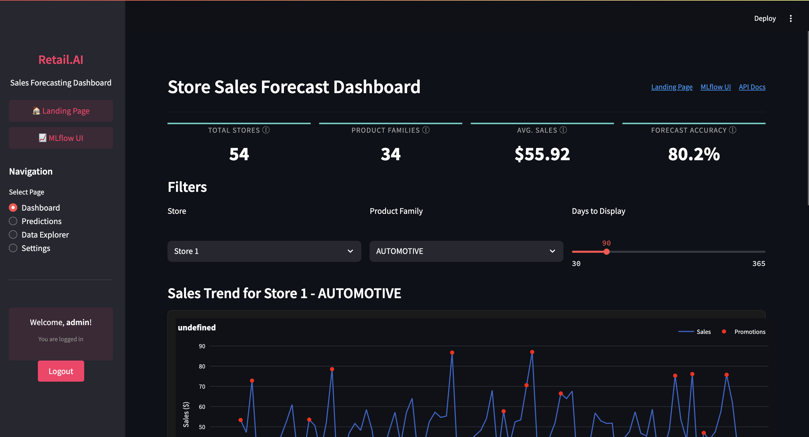
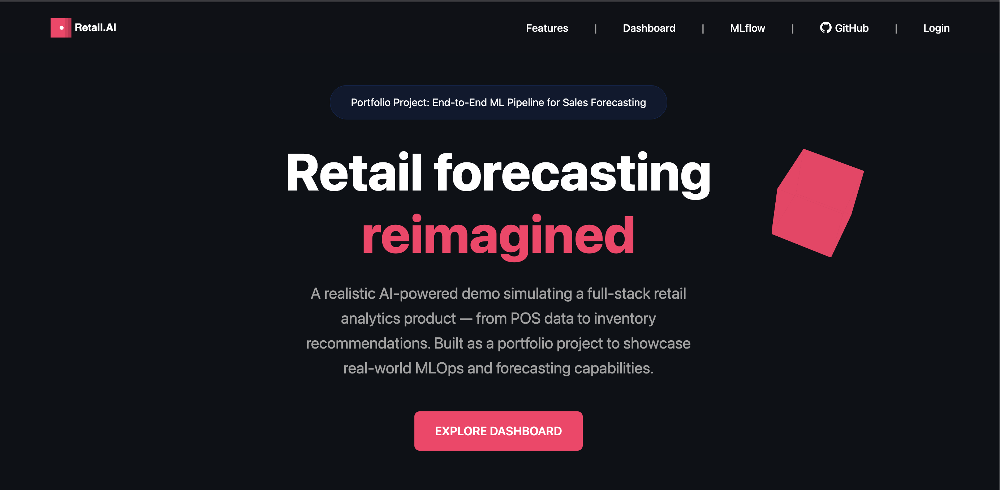
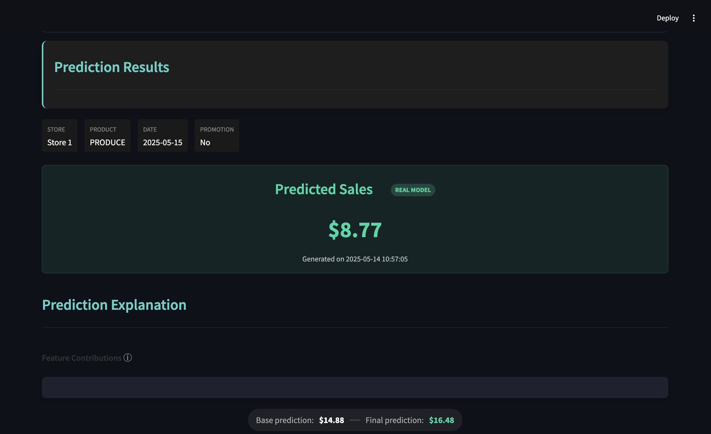
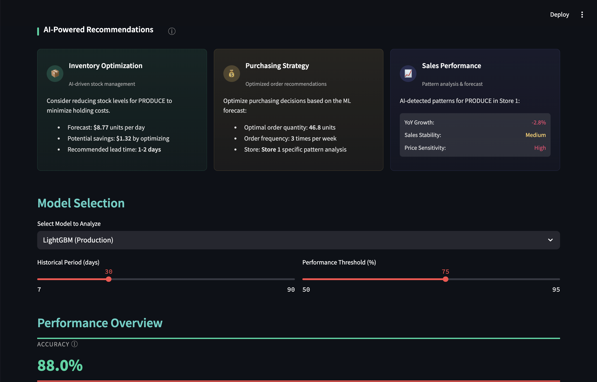

# RetailPro AI: Sales Forecasting Platform

<div align="center">
  


</div>

<p align="center">
  
</p>

## 🎯 Business Problem

Retail chains face significant challenges in inventory management, with both overstocking and understocking leading to substantial financial losses:

- **Overstocking** ties up capital and leads to markdowns and waste
- **Understocking** results in lost sales and reduced customer satisfaction
- **Seasonal variations** complicate manual forecasting approaches
- **Promotion planning** requires accurate sales predictions

RetailPro AI addresses these challenges by providing precise, store-level forecasts across all product families, enabling retailers to optimize inventory levels, plan promotions effectively, and maximize profitability.

## 💡 Solution

Our platform delivers an end-to-end forecasting solution that:

- **Predicts sales** with 80%+ accuracy for 54 stores across 34 product families
- **Visualizes trends** through an intuitive dashboard with customizable filters
- **Explains predictions** using explainable AI techniques to build trust
- **Monitors performance** with real-time drift detection and model metrics
- **Secures data** with robust JWT authentication and role-based access

## 🔍 Key Features

<table>
  <tr>
    <td width="33%">
      <h3 align="center">📊 Interactive Dashboard</h3>
      <p align="center">Real-time visualization of sales trends with powerful filtering and drill-down capabilities</p>
    </td>
    <td width="33%">
      <h3 align="center">🔮 ML Predictions</h3>
      <p align="center">Generate accurate forecasts using advanced machine learning models with proven accuracy</p>
    </td>
    <td width="33%">
      <h3 align="center">📈 Performance Analysis</h3>
      <p align="center">Track forecast accuracy and model drift with automated monitoring and alerts</p>
    </td>
  </tr>
  <tr>
    <td width="33%">
      <h3 align="center">🔍 Model Insights</h3>
      <p align="center">Understand predictions with explainable AI and feature importance visualization</p>
    </td>
    <td width="33%">
      <h3 align="center">🔒 Enterprise Security</h3>
      <p align="center">JWT-based authentication with role-based access control and data encryption</p>
    </td>
    <td width="33%">
      <h3 align="center">⚙️ MLOps Integration</h3>
      <p align="center">Complete integration with MLflow for experiment tracking and model versioning</p>
    </td>
  </tr>
</table>

## 📊 Performance Metrics

<div align="center">
  
| Metric | Value | Description |
|--------|-------|-------------|
| **Forecast Accuracy** | 80.17% | Overall accuracy of predictions |
| **MAPE** | 19.83% | Mean Absolute Percentage Error |
| **MAE** | 46.16 | Mean Absolute Error |
| **RMSE** | 50.64 | Root Mean Square Error |

</div>

## 🛠️ Technical Architecture

Our platform follows a modern microservices architecture with three main components:

<p align="center">
  
</p>

```
┌───────────────────┐     ┌──────────────────┐     ┌────────────────┐
│                   │     │                  │     │                │
│ Streamlit         │─────▶ FastAPI          │─────▶ ML Models      │
│ Dashboard         │     │ Backend          │     │ & Predictions  │
│                   │     │                  │     │                │
└───────────────────┘     └──────────────────┘     └────────────────┘
                                   │                        │
                                   ▼                        ▼
                          ┌──────────────────┐     ┌────────────────┐
                          │                  │     │                │
                          │ Authentication   │     │ Feature        │
                          │ & Security       │     │ Engineering    │
                          │                  │     │                │
                          └──────────────────┘     └────────────────┘
                                                            │
                                                            ▼
                                                   ┌────────────────┐
                                                   │                │
                                                   │ Monitoring     │
                                                   │ & Metrics      │
                                                   │                │
                                                   └────────────────┘
```

## 🧰 Tech Stack

<div align="center">
  
### Frontend


### Backend


### ML & Data Science


### DevOps & Monitoring


</div>

## 📂 Project Structure

```
mlproject/
├── src/
│   ├── api/              # FastAPI application for model serving (port 8002)
│   ├── dashboard/        # Streamlit interface with visualizations (port 8501)
│   ├── landing/          # Landing page and authentication (port 8000)
│   ├── database/         # Database models and connection utilities
│   ├── features/         # Feature engineering pipeline
│   ├── models/           # ML model definition, training and evaluation
│   ├── security/         # Authentication and authorization
│   └── utils/            # Shared utility functions
├── docs/
│   └── images/           # Documentation images and screenshots
├── models/               # Serialized model artifacts
├── tests/                # Automated test suite
├── monitoring/           # Monitoring and alerting components
├── publish_github.sh     # Script for versioning and GitHub publishing
└── requirements.txt      # Python dependencies
```

## 🚀 Local Development Setup

```bash
# Clone the repository
git clone https://github.com/onchainlabs1/forecast-pipeline.git
cd mlproject

# Create virtual environment
python -m venv venv
source venv/bin/activate  # On Windows: venv\Scripts\activate

# Install dependencies
pip install -r requirements.txt

# Start all services (on separate terminals)
# 1. Landing page and authentication
python -m uvicorn src.landing.server:app --host 0.0.0.0 --port 8000

# 2. API server
cd src/api && python -m uvicorn main:app --host 0.0.0.0 --port 8002

# 3. MLflow tracking server (optional)
mlflow ui --port 8888 --host 0.0.0.0

# 4. Streamlit dashboard
python -m streamlit run src/dashboard/app.py --server.port=8501
```

## 📱 Services

| Service | Port | Description |
|---------|------|-------------|
| Landing Page | 8000 | Project homepage and authentication |
| API Server | 8002 | Backend for data and predictions |
| Streamlit Dashboard | 8501 | Interactive visualization interface |
| MLflow Server | 8888 | Model tracking and experiment management |

## 🔐 Authentication

The system uses JWT-based authentication with the following demo credentials:
- **Username**: johndoe
- **Password**: secret

Or admin access:
- **Username**: admin
- **Password**: admin

## 📸 UI Showcase

### Landing Page
The modern landing page introduces the project with a sleek dark theme design:

<div align="center">
  
</div>

Key features highlighted on the landing page:
- Modern dark theme with professional design
- Clear project description and value proposition
- Quick access to dashboard and documentation
- Real-time metrics display

### Interactive Dashboard
The main dashboard provides comprehensive sales analytics and forecasting:

<div align="center">
  
</div>

Dashboard highlights:
- Real-time sales metrics and KPIs
- Interactive store and product family selection
- Historical sales trends visualization
- Forecast explanations and insights

### Prediction Interface
The prediction interface offers detailed forecasts with explanations:

<div align="center">
  
</div>

Features:
- Individual store and product predictions
- Feature importance visualization
- SHAP value explanations
- Confidence intervals

### Performance Metrics
Comprehensive performance tracking and model evaluation:

<div align="center">
  
</div>

Key metrics:
- Forecast accuracy by store/product
- Historical performance trends
- Error analysis and distribution
- Model comparison tools

## ⚠️ Demo Project Disclaimer

This project is a demonstration/portfolio piece created to showcase technical skills and design capabilities. It simulates a retail forecasting system with sample data and is not connected to actual retail operations. While the models provide realistic predictions based on the simulated data, they are intended for demonstration purposes only.

## 🚢 Deployment Information

Current deployment branch: `feature/lovable-landing`
Version: 1.0.0

## 🤝 Contributing

Contributions are welcome! Please follow these steps:

1. Fork the repository
2. Create your feature branch (`git checkout -b feature/amazing-feature`)
3. Commit your changes (`git commit -m 'Add some amazing feature'`)
4. Push to the branch (`git push origin feature/amazing-feature`)
5. Open a Pull Request

## 📄 License

This project is licensed under the MIT License - see the LICENSE file for details.